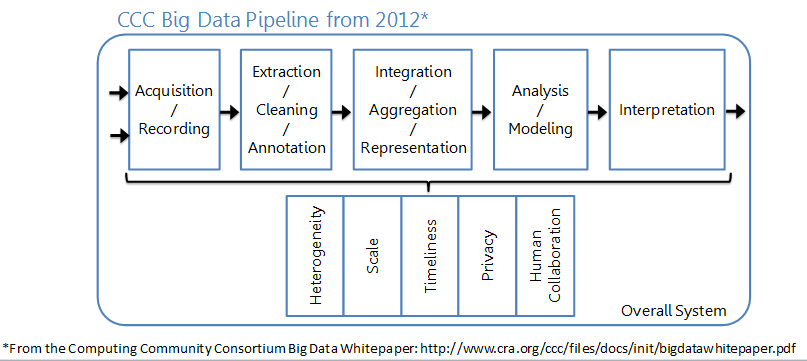
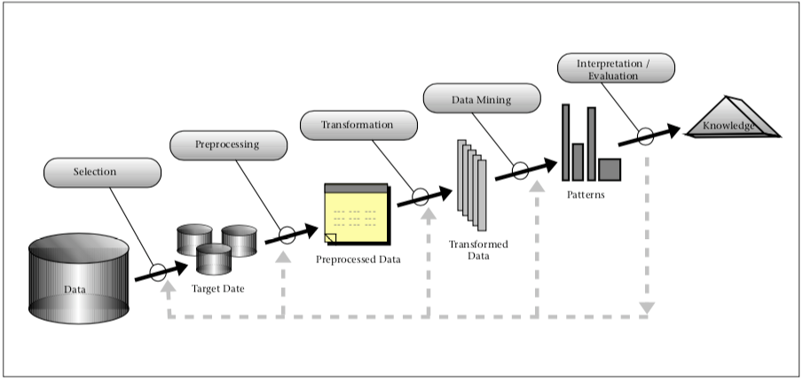
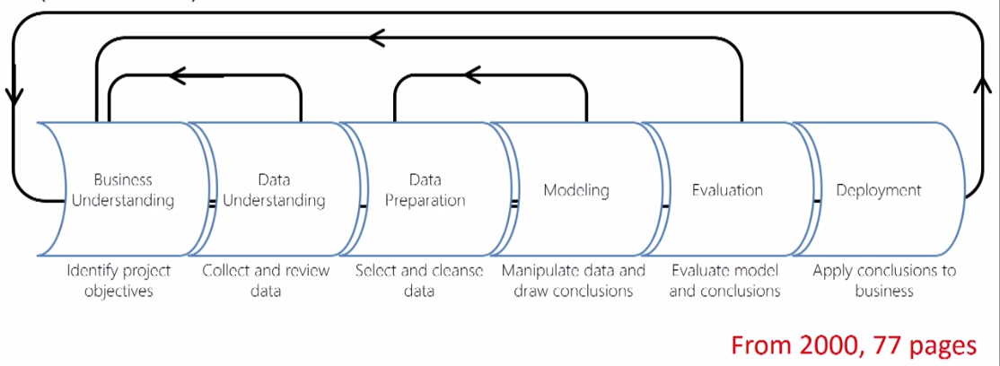

# Introduction to Machine Learning


## High Level Data Science Process

### Overview

- Historical Notes on **KDD**, **CRISP-DM**, **Big Data** and **Data Science** and their relationship to Data Mining and Machine Learning
- Example of the knowledge discovery process

### Historical Note

- Term **"Big Data"** coined by astronomers Cox and Ellsworth in 1997

```{r CCC, echo=FALSE, fig.cap="", out.width='80%'}

```

- **KDD (Knowledge Discovery in Databases) Process**

```{r KDD, echo=FALSE, fig.cap="Based on content in From Data Mining to Knowledge Discovery", out.width='80%'}

```

- **Cross Industry Standard Process for Data Mining (CRISP-DM)**

```{r CRISP-DM, echo=FALSE, fig.cap="", out.width='80%'}

```


- The stages are basically the same no matter who invents or reinvents the (Knowledge discovery / data mining /big data / data science) process. You may not always need all the stages.

- Data science is an iterative process. - Backwards arrows on most process diagrams.

### Example of the knowledge discovery process

I'll walk you through the knowledge discovery process with an example - the process of predicting power failures in Manhattan.

**Motivation for Example**

* In NYC the peak demand for electricity is rising.
* The infrastructure dates back to the 1880's from the time of Thomas Edison.
* Power failures occur fairly often (enough to do statistic) and are expensive to repair
* We want to determine how to prioritize manhole inspections in order to reduce the number of manhole events (fires, explosions, outages) in the future.
* This is a real problem.

**Stagse in the knowledge discovery procss**

1. Opportunity Assessment & Business Understanding 
2. Data Understanding & Data Acquisition
3. Data Preparation, including Cleaning and Transformation
4. Model Building
5. Policy Construciton
6. Evaluation, Residuals and Metrics
7. Model Deployment, Monitoring, Model Updates

**Opportunity Assessment & Business Understanding**

What do you really want to accomplish and what are the constraints? What are the risks? 
How will you evaluate the quality of the results?

For manhole events the general goal was to "Predict manhole fires and explosions before they occur." We made it ore precise:

* Goal 1: Assess predictive accuracy for predicting manhole events in the uear before they happen.
* Goal 2: Create a cost-benefit analysis for inspection policies that takes into account the cost of inspections and manhole fires. Determine how often manholes need to be inspected.


---

## Overview of Machine Learning with K-Means Classifiers